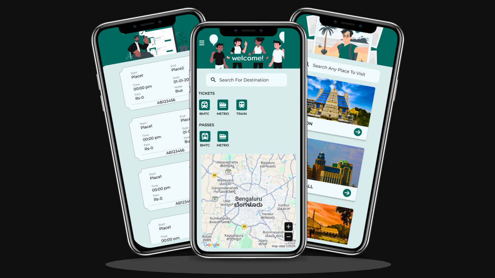
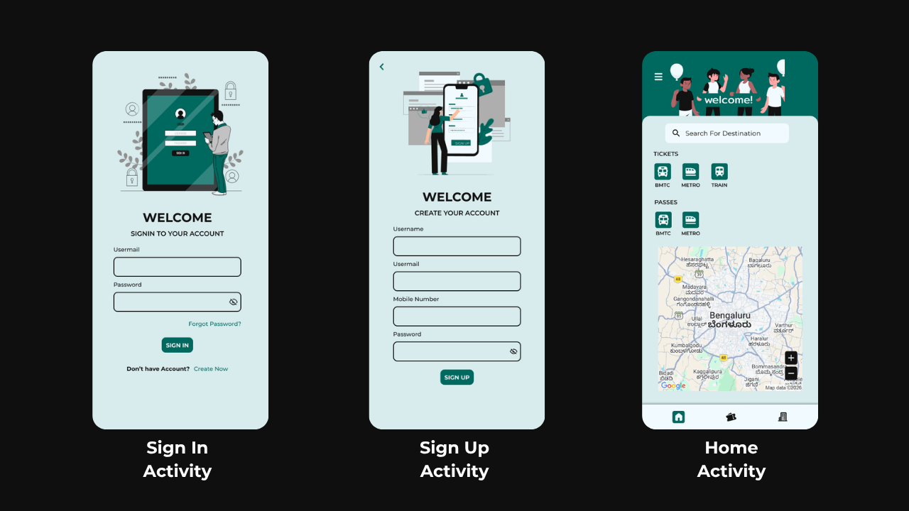
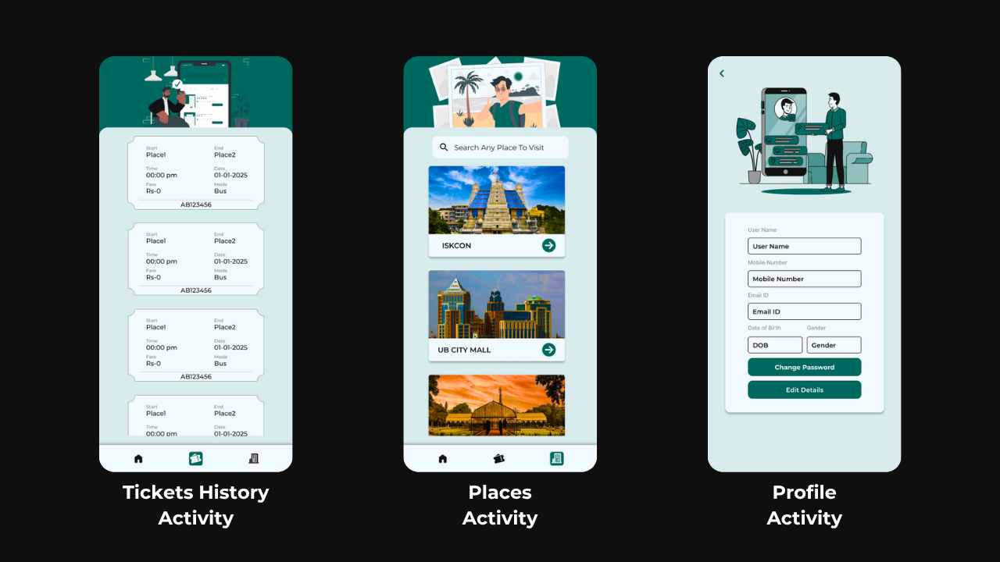

# 📱 TransportBuddy - Ticket Booking App



## 📖 Overview
Transport Buddy is a modern Android ticket booking application designed to simplify travel within Bengaluru. The app allows users to book tickets for multiple modes of public transportation, including **Bus**, **Metro** and **Train** through a single, user-friendly platform. The project focuses on providing a seamless booking experience with a user-friendly interface, easy navigation and quick access to travel information. It was developed as a practical learning project to gain hands-on experience in Android development, Firebase integration, cloud services and modern mobile UI/UX design.

---

## 🚀 Key Features

The app consists of the following activities:

- 🔐 Login Activity
- 🔑 Signup Activity
- 🏠 Home Activity
- 🎫 Ticket History Activity
- 📍 Places Information Activity
- 👤 Profile Activity
- ❓ FAQ Activity

---

## 🧑‍💻 Tech Stack

- Java
- Android XML
- Firebase Authentication
- Firebase Real-time Database
- Cloudinary
- Glide
- Android SDK
- Constraint Layout
- Recycler View
- Bottom Navigation View
- Navigation Drawer

---

## ✨ Highlights

- Secure User Authentication with Firebase
- Book tickets for different travel modes with-in Bengaluru
- Browse travel destinations and place information
- Responsive and user-friendly interface
- Image storage and management using Cloudinary
- Fast image loading with Glide
- Smooth navigation using Navigation Drawer and Bottom Navigation Bar
- Designed from Figma and implemented in Android XML

---

## 📁 Project Structure
```
Transport-Buddy/
│
├── ProjectScreenShots/
│   └── screenshots...
│
├── app/
│   ├── build.gradle
│   │
│   └── src/
│       ├── main/
│       │   │
│       │   ├── AndroidManifest.xml
│       │   │
│       │   ├── java/
│       │   │   └── com/example/transportbuddy/
│       │   │       ├── LoginActivity.java
│       │   │       ├── SignupActivity.java
│       │   │       ├── HomeActivity.java
│       │   │       ├── TicketHistoryActivity.java
│       │   │       ├── PlacesInformationActivity.java
│       │   │       ├── ProfileActivity.java
│       │   │       ├── FAQActivity.java
│       │   │       │
│       │   │       ├── fragments/
│       │   │       ├── adapters/
│       │   │       └── models/
│       │   │
│       │   └── res/
│       │       ├── drawable/
│       │       ├── layout/
│       │       ├── menu/
│       │       ├── mipmap/
│       │       ├── navigation/
│       │       ├── values/
│       │       │   ├── colors.xml
│       │       │   ├── strings.xml
│       │       │   └── themes.xml
│       │       └── ...
│       │
│       └── test/
│
├── gradle/
│   └── ...
│
├── .gitignore
├── build.gradle
├── gradle.properties
├── gradlew
├── gradlew.bat
├── settings.gradle
└── README.md
```

---

## 📷 Screenshots

### Screenshot 1



### Screenshot 2



---

## 📖 What I Learned

While building this project, I gained experience with:

- Android Intents
- CardView-Based UI
- Glide Image Loading
- Fragment Based Navigation
- RecyclerView Implementation
- Cloudinary for Image Management
- Clean UI/UX Development Practices
- Converting Figma Designs into Android XML Layouts
- Navigation Drawer and Bottom Navigation Bar Setup
- Firebase Authentication and Realtime Database Integration

---

<div align="center">


</div>

---